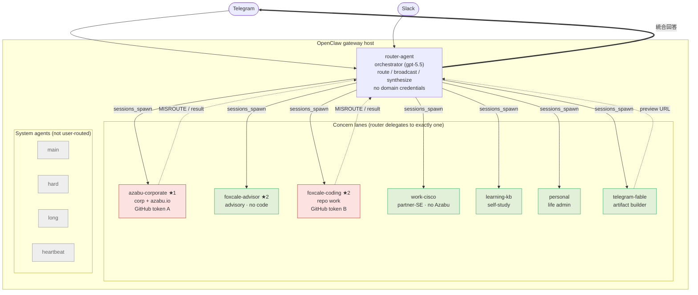
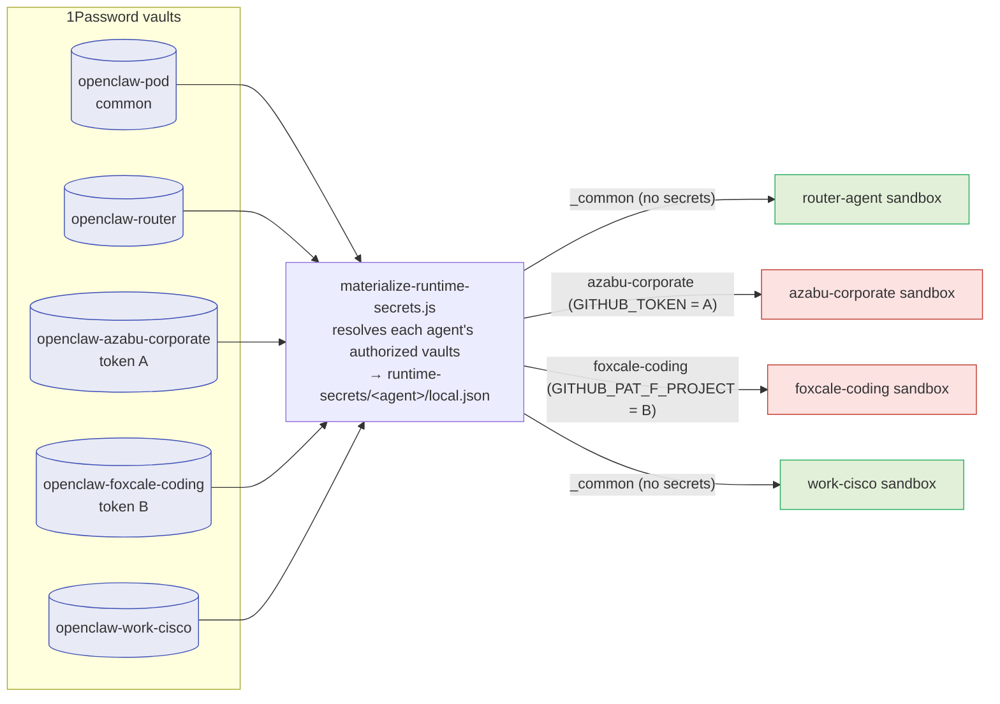

# Agent System Overview

The whole-system view of the deployed OpenClaw concern-lane setup on this host:
channel ingress, the orchestrator, the operator's five concern lanes, the
per-agent sandboxes, and the per-vault authorization boundary.

This is now the **single** active design. The lanes are the operator's real
concerns ("関心事"):

| Concern | Agent(s) | GitHub token |
| --- | --- | --- |
| ★1 Azabu corporate ops + `azabu.io` site maintenance | `azabu-corporate` | **token A** (`GITHUB_TOKEN`, `openclaw-azabu-corporate`) |
| ★2 foxcale customer work | `foxcale-advisor` (advisory), `foxcale-coding` (repo) | **token B** (`GITHUB_PAT_F_PROJECT`, `openclaw-foxcale-coding`) |
| Cisco partner-SE | `work-cisco` | none (no Azabu element) |
| self-study | `learning-kb` | none |
| personal | `personal` | none |

Plus the artifact lane `telegram-fable`, the orchestrator `router-agent`, and the
system agents `main`/`hard`/`long`/`heartbeat`.

- Whole-of-host view (operate/maintain planes, container lifecycle): [`host-topology.md`](host-topology.md)
- Routing/contracts: [`config/openclaw-concern-lanes/README.md`](../config/openclaw-concern-lanes/README.md)
- Routing policy (keywords, broadcast, slash commands): [`routing-policy.json`](../config/openclaw-concern-lanes/routing-policy.json)
- Authorization model: [`agent-authz-vault-model.md`](agent-authz-vault-model.md)
- Source of truth: [`vault-access-map.json`](../config/openclaw-concern-lanes/vault-access-map.json)

## Orchestration & routing

`router-agent` is the only user-facing agent. It understands the request, routes
to exactly one concern lane (or broadcasts and self-selects), streams partial
results back, and synthesizes a final `統合回答`. Leaf concern agents may only
delegate back to `router-agent` (`subagents.allowAgents: ["router-agent"]`) and
deny `sessions_send`, so they cannot form delegation loops. `tools.agentToAgent`
is disabled globally.

The router keeps `exec`/`process` in its allowlist on purpose: OpenClaw applies
the requester's tool restrictions to spawned children, so the coding lanes need
those tools present on the router to retain shell access. The router holds **no**
domain credentials (empty `_common` secret mount), which bounds the blast radius.

## Authorization: per-agent sandbox ← per 1Password vault

Each agent's sandbox mounts **only its own** runtime-secret snapshot, materialized
from **only the vaults that agent is authorized for**
(`materialize-runtime-secrets.js`). Authorization is enforced at the host boundary
(mount + materializer), not by prompt text.

The two customer GitHub tokens are the critical case: ★1 (Azabu) and ★2 (foxcale)
live in **disjoint vaults** and never mix. `azabu-corporate` mounts only its own
snapshot (token A); `foxcale-coding` mounts only its own (token B). `work-cisco`
is authorized for neither and holds no GitHub token, so Cisco work carries no
Azabu element.

`foxcale-coding` uses `foxcale-github-auth.sh` as its sandbox setup command so
`GITHUB_PAT_F_PROJECT` becomes the effective git/`gh` token. Its fallback to a
generic `GITHUB_TOKEN` is harmless because the foxcale snapshot only ever contains
token B — the isolation is enforced by the mount, not by the script. The router,
advisory, Cisco, learning, and personal lanes mount the empty `_common` snapshot.

The credential-isolation invariants are locked by
[`tests/vault-access-map.test.mjs`](../tests/vault-access-map.test.mjs); the
routing/contract invariants by
[`tests/concern-lanes-config.test.mjs`](../tests/concern-lanes-config.test.mjs)
and [`tests/routing-policy.test.mjs`](../tests/routing-policy.test.mjs). See the
rationale and sources in [`agent-authz-vault-model.md`](agent-authz-vault-model.md).
