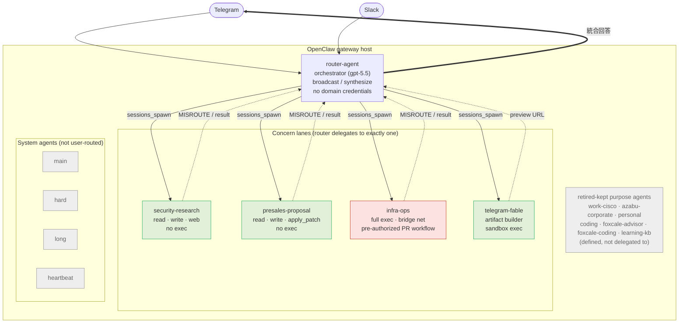
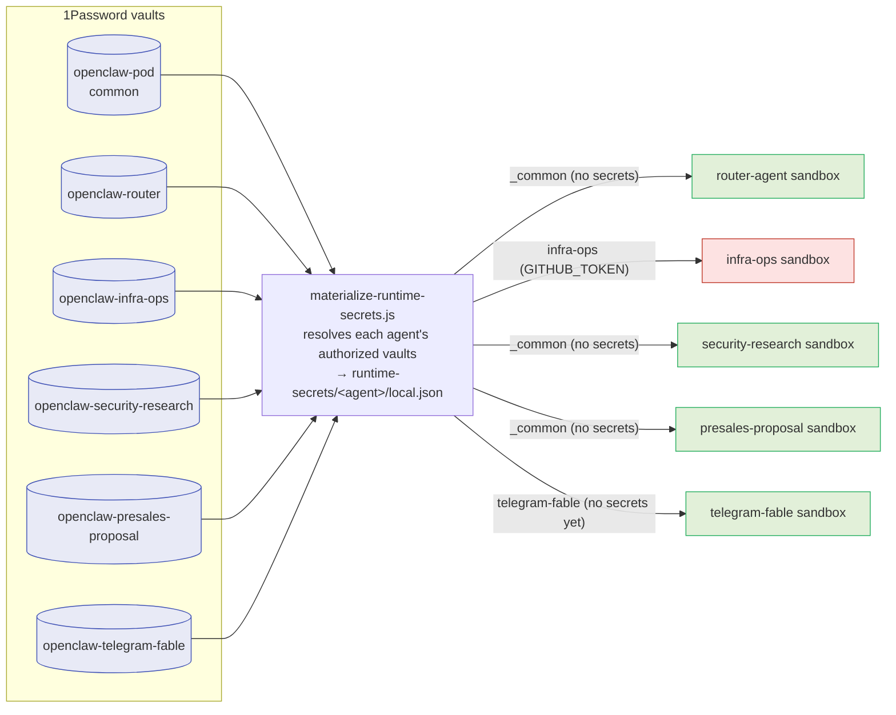

# Agent System Overview

The whole-system view of the deployed OpenClaw concern-lane setup on this host:
channel ingress, the orchestrator, the concern lanes, the per-agent sandboxes,
and the per-vault authorization boundary.

- Routing/contracts: [`config/openclaw-concern-lanes/README.md`](../config/openclaw-concern-lanes/README.md)
- Authorization model: [`agent-authz-vault-model.md`](agent-authz-vault-model.md)
- Source of truth: [`vault-access-map.json`](../config/openclaw-concern-lanes/vault-access-map.json)

## Orchestration & routing

Leaf lanes deny `sessions_send`/`sessions_spawn` so they cannot form delegation
loops; only `router-agent` orchestrates. `tools.agentToAgent` is disabled
globally.

## Authorization: per-agent sandbox ← per 1Password vault

Each agent's sandbox mounts **only its own** runtime-secret snapshot, materialized
from **only the vaults that agent is authorized for**. Authorization is enforced
at the host boundary (mount + materializer), not by prompt text.

Before hardening, a single aggregate snapshot was mounted into **every** sandbox,
so the GitHub credentials reached every lane. Now `infra-ops` is the only lane
holding a GitHub token; `router-agent` and the non-coding lanes mount the empty
`_common` snapshot. See the rationale and sources in
[`agent-authz-vault-model.md`](agent-authz-vault-model.md).
