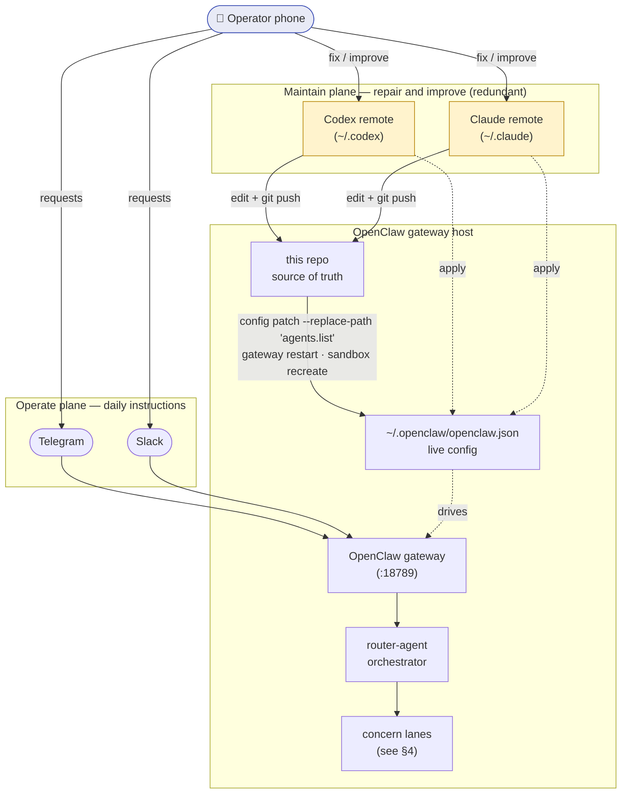
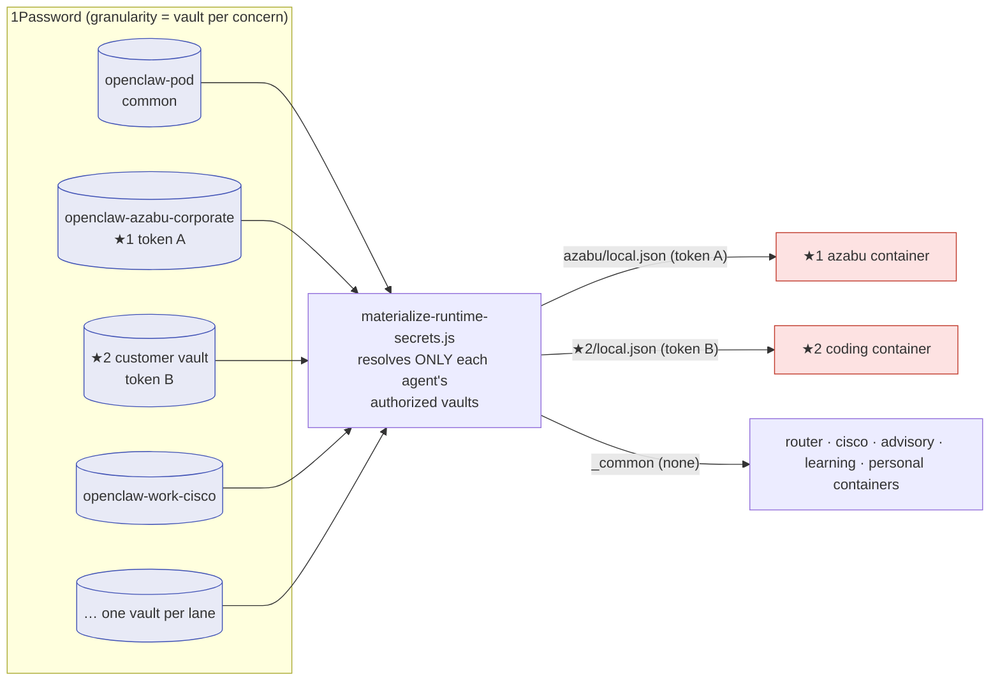

# OpenClaw Host Topology

The whole-of-host picture: how the operator drives this OpenClaw deployment from a
phone, the two redundant maintenance paths, how 1Password vaults control access
granularity, and how the sandbox **image → container instance → session** and the
agents relate to each other.

> Redaction note: the ★2 lane is a customer engagement. The customer name is kept
> out of this document; only the generic labels `★2 advisor` / `★2 coding` are
> used here (the real agent IDs live in the config files only).

For the agent orchestration/authorization detail see
[`agent-system-overview.md`](agent-system-overview.md) and
[`agent-authz-vault-model.md`](agent-authz-vault-model.md).

## 1. Two planes: operate from the phone, maintain from the phone

The operator never touches the host directly. There are two independent paths,
both initiated from a phone:

- **Operate plane** — day-to-day instructions over Telegram/Slack into the
  OpenClaw gateway.
- **Maintain plane** — troubleshooting and feature work via **Codex remote** and
  **Claude remote**, two CLI agents that live on the host. They are *redundant*:
  either one can repair the host if it misbehaves. They edit this repo (source of
  truth) and apply it to the live host.



Either maintenance agent can perform the full apply sequence
(`config/openclaw-concern-lanes/README.md`), so a failure or unavailability of one
does not block host recovery — that is the redundancy.

## 2. Container image → instance → session

All sandboxes share **one immutable image**. OpenClaw starts a **container
instance per session** (`scope: session`, prefix `openclaw-sbx-`); the `main`
agent runs on the host (`mode: non-main`), every other agent runs in a sandbox
container. Each phone conversation is a session, and when `router-agent` delegates
via `sessions_spawn` it opens a **child session** that gets its own container.

```mermaid
flowchart TB
    IMG["Container image (shared, immutable)<br/>openclaw-sandbox-tools:20260531<br/>network bridge · user 1000:1000 · capDrop ALL"]

    subgraph sessions["Sessions (per channel-peer, plus spawned children)"]
        SU1["session: telegram:peer<br/>→ router-agent"]
        SC1["spawned session<br/>→ ★1 azabu-corporate"]
        SC2["spawned session<br/>→ ★2 coding"]
        SC3["spawned session<br/>→ work-cisco"]
    end

    subgraph instances["Container instances (scope = session, openclaw-sbx-*)"]
        I0["openclaw-sbx-…(router)"]
        I1["openclaw-sbx-…(azabu)"]
        I2["openclaw-sbx-…(★2 coding)"]
        I3["openclaw-sbx-…(cisco)"]
    end

    IMG -. "docker run<br/>(one per session)" .-> I0
    IMG -. .-> I1
    IMG -. .-> I2
    IMG -. .-> I3

    SU1 --> I0
    SC1 --> I1
    SC2 --> I2
    SC3 --> I3

    I1 -. "ro mount" .-> kA["secret snapshot:<br/>azabu (token A)"]
    I2 -. "ro mount" .-> kB["secret snapshot:<br/>★2 (token B)"]
    I0 -. "ro mount" .-> kC["_common (no secrets)"]
    I3 -. "ro mount" .-> kC

    classDef img fill:#e2f0d9,stroke:#27ae60;
    classDef priv fill:#fde2e2,stroke:#c0392b;
    class IMG img;
    class I1,I2,kA,kB priv;
```

One image, many short-lived instances, one instance per session — so a compromised
or misbehaving session is bounded to its own container, and the credentials it can
see are only the snapshot mounted into *that* container.

## 3. 1Password vaults = access granularity

Access is controlled at the **vault** level, resolved into a **per-agent
snapshot** at the host boundary by `materialize-runtime-secrets.js`, then mounted
read-only into only that agent's container (§2). This is where the access
granularity lives.



★1 (token A) and ★2 (token B) sit in **disjoint vaults**, materialized into
**separate snapshots**, mounted into **separate containers** — they never mix.
`work-cisco` is authorized for neither, so its work carries no ★1 element.

## 4. Agent relationships

`router-agent` is the only user-facing agent; concern lanes may only return to the
router, so no delegation loops form. The lanes are the operator's concerns.

```mermaid
flowchart TD
    gw([Telegram / Slack ingress]) --> R

    R["router-agent<br/>orchestrator · no domain credentials"]

    subgraph laneset["Concern lanes (router routes to exactly one)"]
        AZ["★1 azabu-corporate<br/>corp + site maintenance · token A"]
        A2["★2 advisor<br/>advisory · no token"]
        C2["★2 coding<br/>repo work · token B"]
        WC["work-cisco<br/>partner-SE · no ★1 element"]
        LK["learning-kb<br/>self-study"]
        PE["personal<br/>life admin"]
        TF["telegram-fable<br/>artifact builder"]
    end

    R -->|sessions_spawn| AZ
    R --> A2
    R --> C2
    R --> WC
    R --> LK
    R --> PE
    R --> TF
    AZ -. "return only to router" .-> R
    C2 -. .-> R
    WC -. .-> R

    subgraph sysset["System agents (not user-routed)"]
        MN["main (on host)"]
        HB["heartbeat"]
        HD["hard"]
        LG["long"]
    end

    classDef priv fill:#fde2e2,stroke:#c0392b;
    classDef safe fill:#e2f0d9,stroke:#27ae60;
    classDef dim fill:#eeeeee,stroke:#999999,color:#666666;
    class AZ,C2 priv;
    class A2,WC,LK,PE,TF safe;
    class MN,HB,HD,LG dim;
```

## How the pieces line up

| Layer | Unit | Isolation boundary |
| --- | --- | --- |
| Control | phone → Telegram/Slack (operate) · phone → Codex/Claude remote (maintain) | two independent planes; remote agents are redundant |
| Authorization | 1Password vault → per-agent snapshot | one vault per concern; ★1/★2 disjoint |
| Runtime | image → container instance → session | one immutable image; one container per session |
| Logic | router-agent → concern lane | lanes return only to router; no loops |
